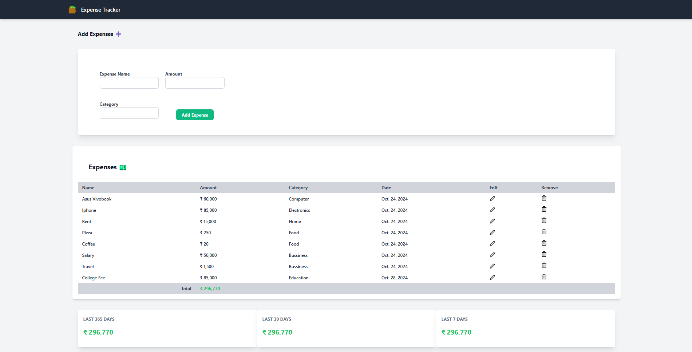

# Expense-Tracker
An Expense Tracker web application built with Django, enabling users to easily add, edit, and monitor their expenses with visual charts and tables. The application includes responsive design using Tailwind CSS and JavaScript for dynamic data visualization.

## Features
* **Add Expense**: Capture expense details such as name, amount, and category.
* **Expense Table**: View and manage all expenses with options to edit and delete entries.
* **Expense Summary**: Summaries for expenses over the last 7 days, 30 days, and 365 days.
* **Categorical Analysis**: Breakdown of expenses by category.
* **Data Visualization**: Daily expense trends and category distribution using charts.

## Screenshots
**Home Page**


**Visualizations**
images/chart.png

**Edit Page**
images/edit.png

## Technologies Used
* **Backend**: Django, Django ORM
* **Frontend**: HTML, Tailwind CSS, JavaScript
* **Data Visualization**: Chart.js

## Setup and Installation

1. **Clone the Repository**:

```bash
git clone https://github.com/AdityaGarasangi/expense-tracker.git
cd expense-tracker
```

2. **Create a Virtual Environment**:

```bash
python -m venv env
source expense_tracker_env/bin/activate  # On Windows use `expense_tracker_env\Scripts\activate`
```

3. Install Dependencies:

```bash
pip install -r requirements.txt
```

4. Run Migrations:

```bash
python manage.py migrate
```

5. Start the Development Server:

```bash
python manage.py runserver
```

6. Access the Application: Open your web browser and go to 
``` http://127.0.0.1:8000/ ```


## Usage
* **Add Expenses**: Use the "Add Expense" section to log new expenses.
* **View Summary**: Summaries and visuals of expenses appear at the dashboard.
* **Edit/Delete Expenses**: Each expense entry provides options to modify or remove the entry.
